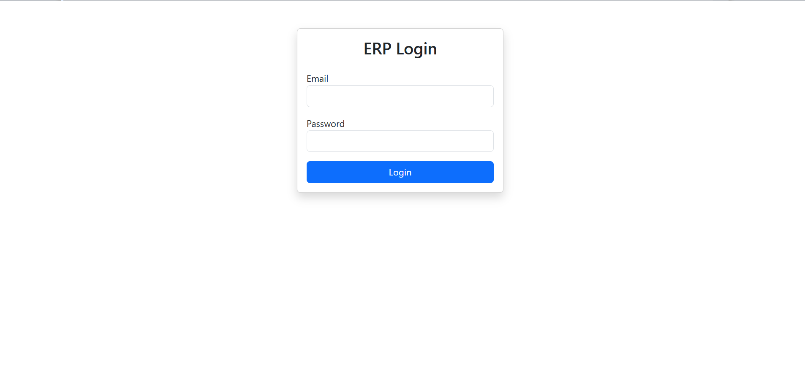
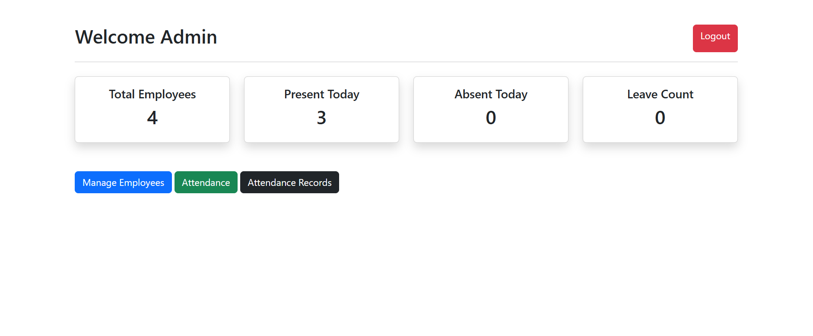
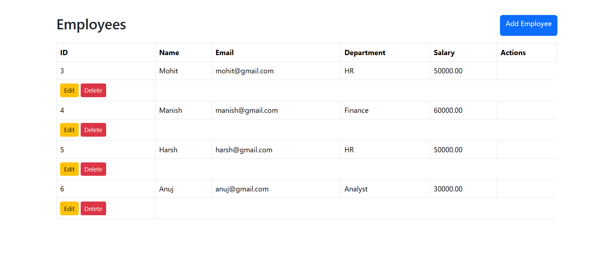
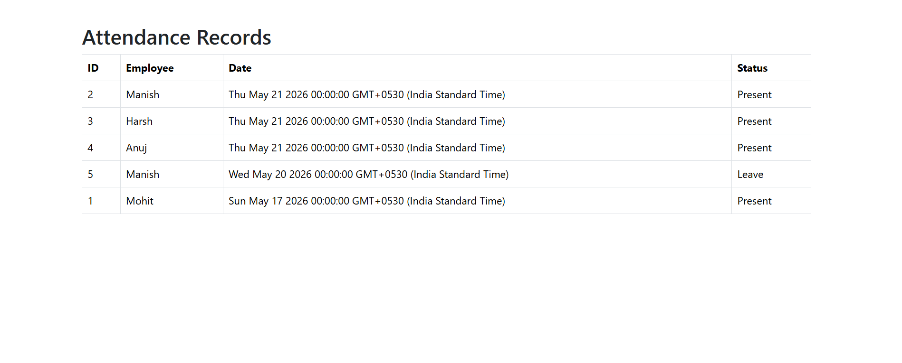

# Employee ERP Tracker

A full-stack ERP management system built using Node.js, Express.js, MySQL, and EJS.

## Features

- Admin Authentication
- Employee Management (CRUD)
- Attendance Management
- Dashboard Analytics
- Session Handling
- MVC Architecture

## Tech Stack

- Node.js
- Express.js
- MySQL
- EJS
- Bootstrap

## Installation

1. Clone repository

```bash
git clone <repo-link>
```

2. Install dependencies

```bash
npm install
```

3. Create `.env`

```env
DB_HOST=localhost
DB_USER=root
DB_PASSWORD=
DB_NAME=erp_tracker
```

4. Start server

```bash
npm run dev
```

## Project Structure

```text
controllers/
models/
routes/
views/
public/
config/
```
## Screenshots

### Login Page



---

### Dashboard



---

### Employee Management



---

### Attendance Module


## Author

Rohit Mittal